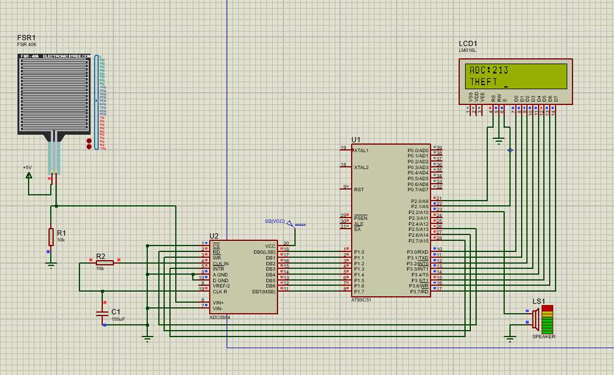

# FSR Security Box

Anti-theft demo for an embedded course: a **force-sensitive resistor (FSR)** feeds an **ADC0804**, an **AT89C51** reads the digital value, shows it on a **16×2 LCD**, and drives a **buzzer** when pressure exceeds a threshold.

## Circuit diagram

The Proteus simulation and wiring are illustrated below.

*Reference: `THEFT_MODE.jpg` — shows the system in alarm state (ADC reading and **THEFT** on the display).*

## Behavior

1. The MCU starts an ADC conversion, waits for completion, then reads the 8-bit result on the data bus.
2. **Line 1** of the LCD shows `ADC:` followed by a three-digit value.
3. If the reading is **≥ 200**, **line 2** shows `THEFT` and the buzzer is pulsed (tone).
4. Otherwise **line 2** shows `SAFE` and the buzzer is off.

Threshold `200` is defined in `8051_with_ADC_and_buzzer.c`; change it to match your FSR divider and calibration.

## Repository contents

| File | Role |
|------|------|
| `8051_with_ADC_and_buzzer.c` | Firmware for AT89C51 |
| `THEFT_MODE.jpg` | Circuit / simulation reference (theft mode) |
| `Safe_Mode.jpg` | Optional screenshot in normal (non-alarm) state |

## Firmware pin assignment (`8051_with_ADC_and_buzzer.c`)

Wire the prototype or align the schematic to match the code, or change the `sbit` / port defines if your board differs.

| Function | Port / pin |
|----------|------------|
| ADC data bus (8-bit) | `P1` (`ADC_DATA`) |
| LCD data (8-bit) | `P3` (`LCD_DATA`) |
| LCD RS | `P2.0` |
| LCD E (enable) | `P2.1` |
| Buzzer | `P2.2` |
| ADC **RD** (output enable) | `P2.5` |
| ADC **WR** (start conversion) | `P2.6` |
| ADC **INTR** (conversion done) | `P2.7` |

The LCD routines assume write-only use of the display (no separate R/W line toggled in software).

## Toolchain

Build and program with your usual **8051** toolchain (e.g. Keil C51, SDCC) for **AT89C51**, using the clock and memory model required by your board or simulator.